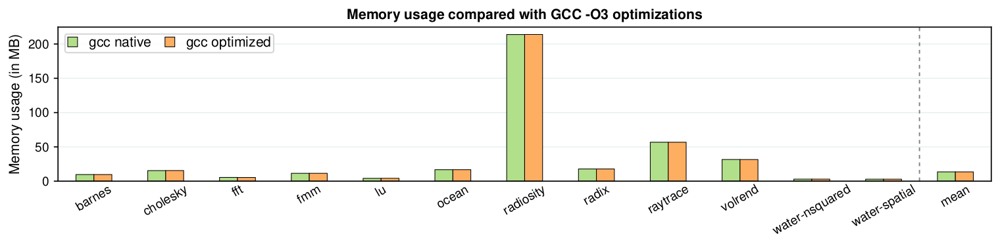

# Fex2

Fex2 is a software evaluation framework.
Its main focus is on performance evaluation and on academic systems projects, but can be re-purposed for other types of evaluation as well.

Our goal was to create a flexible yet simple evaluation tool.
You can start using Fex2 when you need a quick and dirty experiment that verifies your idea, and you can keep extending it until you have a complete, publishable evaluation.
Our secondary goal was to help you avoid committing [Benchmarking crimes](https://www.cse.unsw.edu.au/~gernot/benchmarking-crimes.html), though this is still work in progress.

**NOTE**: This is a revised version of Fex, with a similar functionality, but a considerably different interface. If you're looking for Fex v1, you can find it in the branch `fex-1`.

# Install

```shell script
$ git clone https://github.com/tudinfse/fex.git
$ cd fex
$ sudo python ./setup.py bdist_egg && sudo pip install .
$ fex2
No action specified
usage: fex2 [-h] {...
```

# Preparing a project

Initialize the working directory

```shell script
$ cd your_project
$ mkdir evaluation
$ cd evaluation
$ fex2 init
```

This command will initialize a directory structure for later experiments:
* `install`: bash scripts for installing benchmarks and supporting tools.
* `benchmarks`: source code of the benchmarks and makefiles describing how to build them.
* `build_types`: makefiles describing build configurations. (Confused with two types of makefiles? See [this clarification](#how-does-fex2-build-a-benchmark)).
* `experiments` contains scripts for running experiments, collecting experiment results, and building plots.
Every subdirectory within `experiments` describes how to run a single experiment on a single benchmark (or a benchmark suite).

It will also create a configuration file `config.yaml` which you can use to set the framework's preferences (see [configuration](#config)).

# Running an experiment, in a nutshell

Each experiment in Fex2 consists of five stages.
Two of these stages are preparatory and are executed only once, the first time you run an experiment.

The stages are:
1. **Preparation** [_executed once_]: Create the directories and scripts for running the experiment.
If you're using one of the ready-to-use benchmarks ([list](#list-of-ready-to-use-benchmarks)), the preparation consist of a single command: `fex2 template <experiment name>`.
Otherwise, you have to prepare them yourself ([instructions](#example-3-creating-an-experiment-from-scratch)).
1. **Installing benchmarks** [_executed once_]: Download the benchmark's sources and, if necessary, install them on your system.
Again, when using a preconfigured benchmark, run: `fex2 install <experiment name>`.
Otherwise, install the sources manually.
1. **Building and running the experiment**: Build the benchmarks in a necessary configuration and run them while collecting the experiment data.
Command: `fex2 run <experiment name> -b <list of build types> -o <log>`
1. **Collecting data**: Parse the experiment logs and store the collected data into a csv file. Command: `fex2 collect <experiment name> -i <log> -o <csv file>`
1. **Building plots**: Create a plot of the experimental results. Command: `fex2 plot <experiment name> -i <csv file>`

# How does Fex2 build a benchmark?

We rely on Makefiles for the build process.
If a benchmark uses a different build system, you have to write an adapter Makefile which would call the system with correct parameters.

Every build in Fex2 is defined by two separate Makefiles:
* `build_type/*.mk` defines the benchmark-independent compilation parameters (e.g., compiler, compilation flags, linker, etc.).
* `benchmarks/**/Makefile` defines the benchmark-specific parameters, such as a list of source files, order of compilation, etc.

These files are dynamically combined when running an experiment.
For example, when executing `fex2 run foo -b bar_baz`, Fex2 will build the benchmark `foo`
using the makefiles `build_types/bar_baz.mk` and `benchmarks/foo/Makefile`.

This structure enables easy variability of the experiments.
For example, if you want to build all existing benchmarks in a new build configuration (e.g., with a different compiler),
then you only have to create a single makefile in `build_types` and re-define a single variable in it (e.g., `CC` for a different C compiler).

## Naming convention of the build types

We have a relatively strict naming convention of the files in `build_types`.
The convention is `<type>_<subtype>.mk`.
No subdirectories are allowed (they will be ignored by Fex2).

The `<type>` part of the build type name is its main name.
For example, `<type>` might be a name of a compiler used to build the benchmarks (e.g., `gcc`, `llvm`, `mycustomcompiler`, etc.)
All build types with the same `<type>` part of the name are considered related by Fex2.

The `<subtype>` part is a variation of the build type.
For example, `<subtype>` might be a name of a build configuration (e.g., `optimized`, `alternative_build`, etc.)

The `native` subtypes are used as a baseline when aggregating data and building plots.
If necessary, the baseline subtype can be changed in `config.yaml`.

# Example 1: Benchmarking GCC optimizations on SPLASH 3.0

## TL;DR

```shell script
$ fex2 template splash
$ fex2 install splash
$ cat <<EOF >> build_types/gcc_optimized.mk
include gcc_native.mk
include common.mk

CFLAGS += -O3
EOF
$ fex2 run splash -b gcc_native gcc_optimized -t perf -m 1 4 -r 10 -o splash-raw.txt
$ fex2 collect splash -t perf -i splash-raw.txt -o splash-collected.csv
$ fex2 plot splash -p speedup -i splash-collected.csv -o splash.pdf
```

This will produce a plot (`splash.pdf`) showing the performance improvement of GCC -O3 optimization on SPLASH benchmarks, averaged over 10 runs.

## Explanation

### Prepare
```shell script
$ fex2 template splash
```

Fex2 comes with several benchmarks and benchmarks suites ready to use ([list](#list-of-pre-configured-workloads)).
Accordingly, this command (`template`) copies all the necessary scripts and creates directories for later experiments on SPLASH.
If you want to run a benchmark not shipped with Fex2, you have to write the scripts yourself ([instructions](#manual-experiment-configuration)).

Specifically, the `template` command will:
* create an installation script in the `install` directory
* create a `splash` subdirectory in `experiments` and, within it, create scripts for running performance measurements over SPLASH benchmarks, collecting results, and building plots.
* create makefiles in `bencharms` that will be used to build the SPLASH benchmarks
Your are later free to modify these scripts as you wish.

### Install
```shell script
$ fex2 install splash
```

This command invokes `install/splash.sh` (created by the previous command), which in turn downloads the source code of the benchmarks into `benchmarks/splash`.
It also copies all the necessary makefiles to build the benchmarks (e.g., `benchmarks/splash/fft/Makefile`).

Again, if you want to use your own benchmarks, you need to write the installation script yourself (optional) and create the corresponding makefiles (required).

### Run
```shell script
$ cat <<EOF >> gcc_optimized.mk
include gcc_native.mk
include common.mk

CFLAGS += -O3
EOF
```

The only thing that you have to actually write in this experiment is the build description.
We want to test the optimizations of GCC - accordingly, we add `-O3` to `CFLAGS`.

```shell script
$ fex2 run splash -b gcc_native gcc_optimized -t perf -r 10 -m 1 4 -o splash-raw.txt
```

This will build all the benchmarks in SPLASH in two build configurations (using `build_types/gcc_native.mk` and `build_types/gcc_optimized.mk`),
run them 10 times (`-r 10`), and measure their runtime (`-t perf`). The benchmarks are running in two configurations, with one and four execution threads (`-m 1 4`).

The experiment itself is described in `experiments/splash/run.sh`.

The output of the experiment is stored in `splash-raw.txt`.
If you do not provide the `-o` option, the output will be printed into `stdout`.

If you do not want to see the build logs, you can redirect them into a file with a flag ` --build-output build.txt`.

By default, the builds are stored into `evaluation/build/splash`.
You can change it in `config.yaml` (see [configuration](#config)).

### Collect
```shell script
$ fex2 collect splash -t perf -i splash-raw.txt -o splash-collected.csv
```

Usually, we need to parse the raw output of the experiments before further processing it.
For this purpose, we have `collect.py` scripts (e.g., `experiments/splash/collect.py`).
This command invokes the script for SPLASH.

### Build a plot
```shell script
$ fex2 plot splash -p speedup -i splash-collected.csv -o splash.pdf
```

This command calculates the speedup of `gcc_optimized` over `gcc_native` (`*_native` is always used as a baseline) and
builds a bar plot of the results.
The procedure is described in `experiments/splash/plot.py`.

Internally, we use matplotlib, but you're free to use anything else in your experiments - just re-write `plot.py`.

# Example 2: Modifying an existing experiment
In this example we will modify the splash experiment.

In the first part of this example we will:
 - Change the evaluation from cycles to peak memory consumption.
 - Change the plot to display absolute numbers.

In the second we will make the benchmarks do a smaller run.

Before starting make sure you have already executed the following:
```shell script
$ fex2 template splash
$ fex2 install splash
$ cat <<EOF >> build_types/gcc_optimized.mk
include gcc_native.mk
include common.mk

CFLAGS += -O3
EOF
```

## Measuring peak memory consumption
To measure peak memory consumption instead of cycles, we have to:
* Run the benchmarks with a different profiler, the one which can capture peak memory consumption
* Adapt the output parser
* Adapt the plot generation script

### Measuring memory consumption of SPLASH

To change the evaluation from cycles to peak memory consumption, we have to run the benchmarks with a different profiler other than `perf`. In this example we will use `/usr/bin/time`.

We now have to add a new experiment type `time` to SPLASH.
To add the new experiment type, we have to edit the `run.sh` file of SPLASH as follows:

```shell script
# experiments/splash/run.sh:

...
if [ "$EXPERIMENT_TYPE" == "perf" ]; then
    command='perf stat ??bin ??input 2>&1 > /dev/null'
# New experiment type - time
elif [ "$EXPERIMENT_TYPE" == "time" ]; then
    command='/usr/bin/time --verbose ??bin ??input 2>&1 > /dev/null'
else
    error_exit "splash/run.sh: Unknown experiment type" 1
fi
...
```

### Adapting the parser
To collect the new profile data, we have to adapt the collect script of SPLASH at `experiments/splash/collect.py`.

For that we add the experiment_type `time`:

`elif experiment_type == "time":`

Then we add a parser for the new output format.
A typical output of `/usr/bin/time` looks as follows:
```text
...
Average total size (kbytes): 0
Maximum resident set size (kbytes): 5680
Average resident set size (kbytes): 0
...
```
The collected parameter is an integer which is always located in a line with the text `Maximum resident set size`.
We therefore use the following parser and name the value `memory`:

`"memory": ["Maximum resident set size", lambda l: collect.get_int_from_string(l, ignore_comma=True)]`

The complete collect script:
```python
# experiments/splash/collect.py:

from fex2 import collect, helpers

def parse(infile, outfile, experiment_type):
    if experiment_type == "perf":
        parsers = {
            "cycles": ["cycles", lambda l: collect.get_int_from_string(l, ignore_comma=True)],
            "instructions": [" instructions ", lambda l: collect.get_int_from_string(l, ignore_comma=True)],
            "time": ["seconds time elapsed", lambda l: collect.get_float_from_string(l)],
        }
    elif experiment_type == "time":
        parsers = {
            "memory": ["Maximum resident set size", lambda l: collect.get_int_from_string(l, ignore_comma=True)]
        }
    else:
        return helpers.error_exit(1, "Unknown experiment type")

    collect.parse_logs(infile, outfile, parsers)
```

### Adapting the plot generation
To add a new plot type, we modify `experiments/splash/plot.py`. Specifically, we insert a new `plot_type` `absolute` and create the new plot function `build_plot_absolute`:
```python
def build_plot(infile: str, outfile: str, plot_type: str = 'speedup'):
    if plot_type == 'speedup':
        build_plot_speedup(infile, outfile)
### Modification start ###
    elif plot_type == 'absolute':
        build_plot_absolute(infile, outfile)
### Modification end ###
    else:
        helpers.error_exit(1, 'splash/plot.py: Not supported plot type')

### Modification start ###

def build_plot_absolute(infile: str, outfile: str):
    metadata_columns = ["benchmark", "type", "subtype", "thread_count"]
    data_column = "memory"
    all_columns = metadata_columns + [data_column]

    # load the results into a DataFrame
    helpers.debug("Loading data")
    df = read_csv(infile, usecols=all_columns)
    if df.empty:
        helpers.error_exit(1, "The input file is empty or not readable")

    # aggregate the results of repeated experiments (i.e., average across all runs of the same experiment)
    helpers.debug("Processing results")
    df = DataFrame({data_column: df.groupby(metadata_columns)[data_column].apply(stats.gmean, axis=0)})
    df = df.reset_index()

    # cleanup
    df.dropna(inplace=True)

    # To MB
    df["memory"] = df["memory"] / 1024

    # restructure the table for easier plotting and calculate the overall mean values across all benchmarks
    pivoted = df.pivot_table(
        index="benchmark",
        columns=["type", "subtype", "thread_count"],
        values=data_column,
        margins=True,
        aggfunc=stats.gmean,
        margins_name="mean"
    )
    df = DataFrame(pivoted.to_records()).set_index("benchmark", drop=True)

    # rename builds
    df.rename(columns=RENAMINGS, inplace=True)

    # the resulting table
    helpers.debug("Plot data\n" + str(df))

    # build the plot
    helpers.debug("Building a plot")
    plt = plot.BarPlot(style=SplashBarPlotStyle)
    plt.build(df,
        title="Memory usage compared to GCC -O3 optimizations",
        ylabel="Memory usage (in MB)",
        vline_position=11.5
        )

    plt.savefig(
        outfile,
        dpi="figure",
        pad_inches=0.1,
        bbox_inches='tight'
    )
### Modification end ###
```

You can test the new code with the following commands:
```shell script
$ fex2 run splash -b gcc_native gcc_optimized -t time -m 1 4 -r 10 -o splash-raw-2.txt
$ fex2 collect splash -t time -i splash-raw-2.txt -o splash-collected-2.csv
$ fex2 plot splash -p absolute -i splash-collected-2.csv -o splash-2.pdf
```
Which should give you the following plot:


## Smaller inputs

Sometimes, it is necessary to run the benchmarks with some inputs other than default ones.
For example, it could be useful to quickly test and verify a small change in the experiments.

This can be done by modifying the column `default` of the input table.
The input table `input.csv` can be found in the respective experiment folder.
In this example we are going to adapt the splash benchmark.
The splash input table is located at `experiments/splash/input.csv`.

The `test` column of the input table has easier benchmark inputs then the `default` column.
We can therefore copy the inputs of the test column into the default column to get smaller benchmarks.
With that, the `ocean` benchmark is for instance changed from `-p$thread_count -n258` to `-p$thread_count -n18`.

You can test the new inputs with the normal run command:
```shell script
$ fex2 run splash -b gcc_native gcc_optimized -t time -m 1 4 -r 10 -o splash-raw-2.txt
```
Which should now run a bit faster.
# Example 3: Creating an experiment from scratch

TBD

# Config

TBD

# List of ready-to-use benchmarks

Benchmark suites:
* Splash
* SPEC [Under reconstruction]
* Parsec [Under reconstruction]
* Phoenix [Under reconstruction]

Applications:
* Apache [Under reconstruction]
* Memcached [Under reconstruction]
* Nginx [Under reconstruction]
* PostgreSQL [Under reconstruction]
* SQLite [Under reconstruction]
